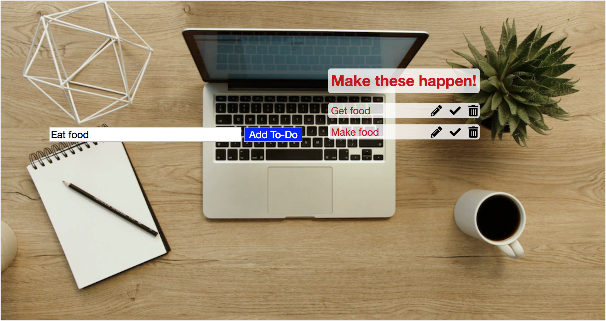

# MakeItHappen
MakeItHappen is a simple to-do list app that utilizes the JavaScript library Domify.



#### How to Implement
Simply download this repo and include the "./lib/domify_main.js" in an HTML file.

#### Example of the code
The below example shows the code behind the "attr()" method, which allows a developer to either get or set attributes for a given HTML element.
```javascript
attr(attributeName, attributeValue){
  if(attributeValue === undefined){
    return this.nodeListArray[0].getAttribute(attributeName);
  } else {
    this.nodeListArray[0].setAttribute(attributeName, attributeValue);
  }
}
```
